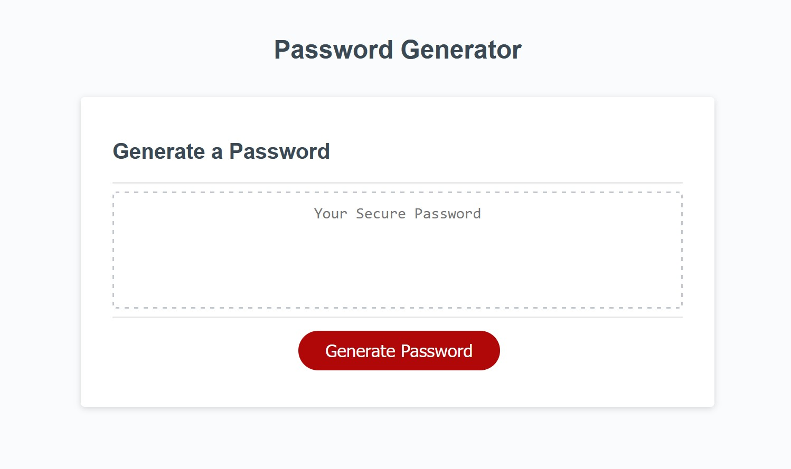

# Password Generator Starter Code
Module 3 Challenge 3

## Purpose
To create a JavaScript password generator based on a given webpage. With my current skillset, I decided that the most efficient way to code the generator was with an array of booleans that called functions in a for loop based on user input and confirmation.

## Built With:
* HTML
* CSS
* JavaScript

## Website
https://xunvyre.github.io/challenge-three/

## Screenshot(s)

## Contributors
Xandromus (original code), Xunvyre
